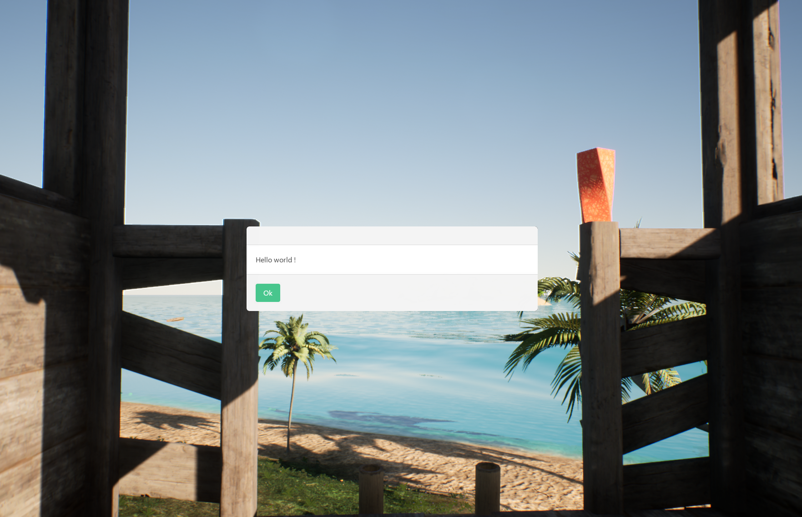
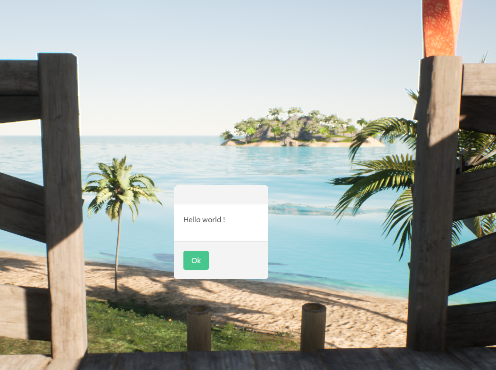

# Hello world

Lets use the [Simple Alert](soonTm) to say hello to the world !

## Displaying the alert

For now we will just create an alert to display the Hello world text.

By default, all alerts will be centered on the screen so we will only set our text.
First, import `trunks-nanos` on top of your file

```lua
Package.RequirePackage("trunks-nanos")
```

Then we will create a [Simple Alert](soonTm) component
```lua
local helloWorldAlert = Trunks:New("SimpleAlert")
```

Finally, we want to set the text to 
```lua
helloWorldAlert:SetText("Hello world")
```

Our script should look like that:
```lua
Package.RequirePackage("trunks-nanos")

local helloWorldAlert = Trunks:New("SimpleAlert")
helloWorldAlert:SetText("Hello world")
```

So let's start the server and look what it looks like in game


The popup looks really big compared to the content so we are going to make it smaller:
```lua
helloWorldAlert:SetSize(200, 200)
```


Awesome ! But it will be quite inconvenient to let the Alert on screen for ever and there is no way to make it go away for now.
Let's add user input and a way to close the popup when clicking Ok

## Getting user input
In order to let the user to move the mouse around we are going to use Nanos World function [
Client.SetMouseEnabled](https://docs.nanos.world/docs/scripting-reference/static-classes/client#setmouseenabled)

Add the following line on top of the script:
```lua
Client.SetMouseEnabled(true)
```

The whole script now looks like this:
```lua
Package.RequirePackage("trunks-nanos")

Client.SetMouseEnabled(true)
local helloWorldAlert = Trunks:New("SimpleAlert")
helloWorldAlert:SetSize(200, 200)
helloWorldAlert:SetText("Hello world !")
```

Now the mouse cursor will appear and we can click on the Button but nothing happends when we click Ok

## Hiding the alert when the user click Ok
For the alert to close when the player clicks Ok we need to give a `OnClickOk` function, it will be called when the player clicks Ok.
Inside this function we will call `Hide` to hide the alert

```lua
helloWorldAlert.OnClickOk = function()
    helloWorldAlert:Hide()
end
```

Remember to give back mouse control to the player too so he can move the camera around again:
```lua
helloWorldAlert.OnClickOk = function()
    helloWorldAlert:Hide()
    Client.SetMouseEnabled(false)
end
```

The script should now looks like this:
```lua
Package.RequirePackage("trunks-nanos")

Client.SetMouseEnabled(true)
local helloWorldAlert = Trunks:New("SimpleAlert")
helloWorldAlert:SetSize(200, 200)
helloWorldAlert:SetText("Hello world !")
helloWorldAlert.OnClickOk = function()
    helloWorldAlert:Hide()
    Client.SetMouseEnabled(false)
end
```

You can also call `Destroy` instead of `Hide` if you are not going to use `helloWorldAlert` anymore.


