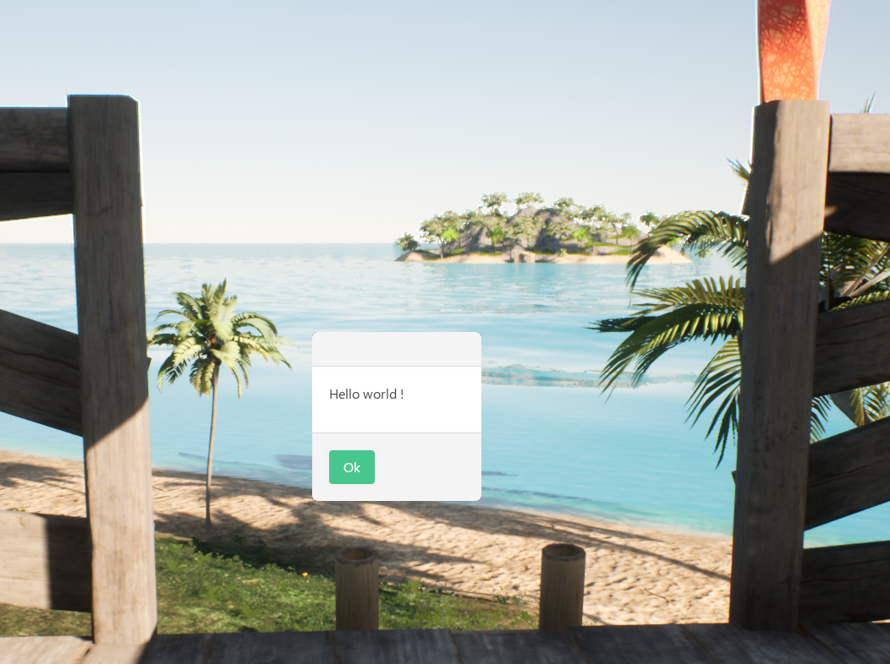

# Tutorials list

| Name  | Description  |  Image |
|---|---|---|
| [Hello World](https://dkfn.github.io/trunks-nanos/tuts/helloWorld)  | Implement an Alert saying Hello  |   |
| [Players Name]()  |  Ask the player name using an Alert |

